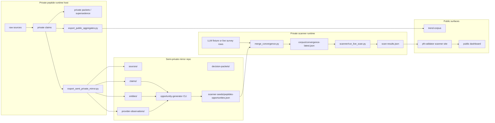

# trend-corpus

Public template for building sector decision corpora that agents can
maintain, validate, and hand off to private runtimes through file
boundaries.

The shape is: **sources -> claims -> theses -> decision packets**, with
append-only supersedence, category-driven half-lives, and a human-review
gate before any private execution. The pattern is proven on a live
peptide-industry runtime; this repo publishes the methodology so other
sectors can spin up the same shape.

See [`docs/architecture.md`](docs/architecture.md) for the design and
[`docs/new-sector-research-workflow.md`](docs/new-sector-research-workflow.md)
for the agent-driven theme-spinup pattern.

## Where this sits in the system

trend-corpus is one of three corpus layers in the [Permanent Upper Class
system](https://github.com/P-U-C) — the **"what is happening"** corpus.
Downstream it feeds **Convergence Daily** (cross-sector market intelligence in
the `editorial` repo) and the **trading scanner**, and exposes its
decision-packets to the machine-readable API. Convergence Daily issues are in turn
forked through the **[convergence-hq dual-publishing engine](https://github.com/convergence-hq/convergence)**,
which emits an immutable, signed, agent-citable **Signal** object per episode (a
separate, forkable publishing surface — *read by humans, cited by machines*).
Sibling corpuses: **swell-checker**
(what is rising) and the planned **audience-corpus** (who you are talking to).
The corpus is the moat; the newsletters and scanner are thin surfaces that ride
on it. See the [org overview](https://github.com/P-U-C) for the full map.

### Roadmap (parked)

A **[unified discovery + categorization layer](https://gist.github.com/0xzoz/e765ac337cc9cac479b3e88552187cc3)**
is designed but deliberately parked. It would give trend-corpus **open,
automatic discovery**: a shared emergence engine (extracted from swell-checker)
ingests broadly, and a categorizer/router proposes a *new sector* whenever a
rising market cluster matches none — firing the existing
[`new-sector-research-workflow`](docs/new-sector-research-workflow.md) instead of
waiting for a human to seed it. Build when breadth of coverage becomes the
bottleneck — not before.

## Canonical B2 architecture

The same diagram is embedded in `puc-trading/README.md` and
`trend-intel-private/README.md`. Mermaid is rendered directly by
GitHub's Markdown renderer; no toolchain required.



This repo is `P4 -> trend-corpus` in the diagram: the public template
with schemas, taxonomy, validator, and reference themes. Public-safe
aggregates from the peptide runtime flow into `trends/peptides/
aggregates/`; rich claim text never enters this repo, it stays
private in P1 and semi-private in P2.

## Repo map

```
trend-corpus/
|-- README.md                       <-- you are here
|-- AGENTS.md                       <-- Claude orchestrator + Codex implementer split
|-- CONTRIBUTING.md
|-- SECURITY.md                     <-- what NEVER goes in + secret-pattern set
|-- LICENSE                         <-- MIT
|-- CHANGELOG.md
|-- Makefile                        <-- validate / test / populate-convergence / scan / up / down
|-- .env.example
|-- .github/workflows/validate.yml  <-- CI: make validate + make test on push/PR
|
|-- docs/
|   |-- architecture.md             # how the pieces fit (the design doc)
|   |-- theme-authoring.md          # how to add a new theme by hand
|   |-- new-sector-research-workflow.md  # how Claude + Codex spin up a new theme
|   |-- metalayer.md                # cross-theme decision service spec
|   |-- llm-convergence.md          # walkthrough of the convergence method theme
|   |-- peptide-example.md          # walkthrough of the canonical peptides theme
|   `-- operations.md
|
|-- schemas/
|   |-- trend.schema.json
|   |-- source.schema.json
|   |-- claim.schema.json
|   |-- entity.schema.json
|   |-- event.schema.json
|   |-- thesis.schema.json
|   |-- decision-packet.schema.json
|   |-- watchlist.schema.json
|   |-- convergence.schema.json     # for the M1 scanner seam artifact
|   `-- aggregates.schema.json      # for live-runtime aggregate exports (Decision 2)
|
|-- taxonomy/
|   |-- claim-categories.yaml       # regulatory / pricing / corporate / manufacturing / market / clinical / methodology
|   |-- execution-states.yaml       # research_only / watchlist_candidate / human_review_required / approved_for_private_execution
|   |-- theme-status.yaml           # emerging / growing / peak_hype / post_peak
|   `-- tiers.yaml                  # HIGH / MEDIUM / LOW
|
|-- trends/                         <-- THIS is where sector themes live
|   |-- _template/                  # copy this when starting a new theme
|   |-- peptides/                   # canonical reference theme (filled)
|   `-- llm-convergence/            # method theme for the cross-model attention signal
|
|-- packages/corpus-validator/      <-- stdlib-only Python validator
|   |-- corpus_validator/
|   `-- tests/
|
|-- apps/                           <-- placeholder service stubs (M4)
|   |-- metalayer-api/              # typed decision service HTTP stub
|   `-- mcp-server/                 # MCP server stub
|
|-- ops/
|   |-- docker-compose.yml
|   `-- runbooks/
|       |-- install.md
|       |-- add-new-theme.md
|       |-- scanner-integration.md
|       |-- deploy-cadence.md
|       `-- peptides-aggregates-bridge.md
|
`-- tests/test_repo_smoke.py        # CI smoke: every trend.yaml validates + no secrets + refs resolve
```

## Quick start

```bash
git clone https://github.com/P-U-C/trend-corpus.git
cd trend-corpus
python3 -m pip install pyyaml pytest
make validate
make test
```

To add a new theme by hand:

```bash
cp -r trends/_template trends/<your-sector>
$EDITOR trends/<your-sector>/trend.yaml
# add source / claim / entity / thesis / decision-packet / watchlist objects
make validate
```

To use the agent-spinup workflow, see
[`docs/new-sector-research-workflow.md`](docs/new-sector-research-workflow.md).

## Theme coverage (LLM Convergence Scanner sectors)

The convergence scanner ranks options across 14 themes. Each one should
get a full peptides-style theme directory here: 8-15 sources, 2-3 example
claims demonstrating the taxonomy, 2-3 entities with tickers, 1 thesis,
1 decision packet with substantive `invalidation_conditions` and
`execution_state: human_review_required`, 1 watchlist.

Run order is **one at a time** with deep research and review per theme,
not batched. Each theme gets its own commit and review pass.

| # | Theme | Status | Notes |
|---|---|---|---|
|  1 | peptides | **[x] Done** (canonical reference) | Mirrors the live peptide-corpus runtime; verbatim extract/packet/validate prompts + aggregate-only bridge contract. |
|  2 | llm-convergence | **[x] Done** (method theme) | Documents the cross-model attention signal as a theme in its own right. |
|  3 | quantum-computing | **[x] Done** | IONQ, QBTS, RGTI; catalyst = next qubit milestone. |
|  4 | ai-infrastructure | **[x] Done** | NVDA, AVGO, VRT, ANET, MU, TSM, DELL; peak_hype. |
|  5 | nuclear-smr | **[x] Done** | BWXT, OKLO, SMR, GEV, CEG, CCJ, LEU; catalyst = policy / data-center PPA. |
|  6 | robotics-humanoid | **[x] Done** | TSLA, ISRG, SYM, SERV; catalyst = Figure AI IPO / Optimus milestone. |
|  7 | defense-ai | **[x] Done** | PLTR, LDOS; catalyst = government autonomy contract. |
|  8 | space-satellite | **[x] Done** | RKLB, ASTS, PL, LUNR; catalyst = broadband / launch contract. |
|  9 | bitcoin-mining | **[x] Done** | MARA, RIOT, CLSK; post_peak. |
| 10 | bci-neurotech | **[x] Done** | BFLY, QSI; emerging; catalyst = Neuralink / Synchron / Merge IPO. |
| 11 | solid-state-battery | **[x] Done** | QS, SLDP, SES; emerging; catalyst = first commercial shipment (QuantumScape Eagle Line + customer billings). |
| 12 | synthetic-biology | **[x] Done** | CRSP, BEAM, NTLA + DNA, TWST, PACB + RXRX, SDGR; growing; catalyst = Casgevy commercial compounding + 2026 in-vivo readout cluster. |
| 13 | edge-ai | **[x] Done** | AMBA, SYNA, LSCC + QCOM, ARM; growing; catalyst = automotive design-in conversion + full-stack platform consolidation (Lattice-AMI, Qualcomm-Arduino). |
| 14 | photonic-computing | **[x] Done** | LITE, COHR + AAOI, MTSI, LASR, POET + MRVL + private Lightmatter/Ayar Labs/Celestial AI; growing; catalyst = NVIDIA $4B anchor + chiplet keystones. |
| 15 | longevity | **[x] Done** | BIOA + ABBV/GOOGL/LLY/NVO + Insilico (HKEX) + private Altos/Calico/Loyal/Retro/NewLimit/Life Bio/Rejuvenate; emerging; catalyst = first cellular reprogramming INDs cleared (2025-2026). |

(Total 15 -- peptides + llm-convergence are the two seed themes; the 13
remaining map 1:1 to the convergence scanner's market-tracking themes.)

Updates land as individual commits with messages like
`theme(quantum-computing): initial seed corpus`. After each theme is
merged, the corresponding row is ticked in this table.

## How a new theme gets researched

Each theme goes through this loop **one at a time**:

1. **Sector definition** -- a paragraph on what the theme covers, what is
   in scope vs out.
2. **Source discovery** (Codex in research mode, web access) -- 8-15
   primary URLs with bucket classification (regulatory primary, company
   IR, trade press, government).
3. **Entity inventory** -- the 5-10 public companies most directly
   exposed, with tickers and roles.
4. **Example claim authoring** -- 2-3 claims that demonstrate the
   category taxonomy (regulatory / manufacturing / market / clinical /
   pricing / corporate) without leaking any private state.
5. **Thesis synthesis** -- one paragraph tying the claims together,
   pointing at the structural argument that makes the theme tradeable.
6. **Decision packet** -- one packet with verdict, supporting theses,
   substantive `invalidation_conditions`, and `execution_state:
   human_review_required` (NEVER `approved_for_private_execution` in
   public corpus).
7. **Watchlist** -- the operational signals worth monitoring on cadence.
8. **Prompts** -- adapt `trends/peptides/docs/prompts.md` to the sector's
   vocabulary if the runtime will mirror that pattern.
9. **Validate + commit** -- `make validate && make test`, commit, push,
   tick the table in this README.

Where they run: in the supervised Codex screen on the private orchestration
box, using research-mode access to public web sources. Outputs are
reviewed against the schema + secrets policy before commit. See
[`docs/new-sector-research-workflow.md`](docs/new-sector-research-workflow.md)
for the full pattern and [`AGENTS.md`](AGENTS.md) for the orchestrator /
implementer split.

### After theme commit -- live-runtime propagation

A new theme committed here flows to its live runtime automatically:

10. **Daily sync** -- each live runtime on the peptide host runs
    `theme_runtime sync --from <local-trend-corpus-checkout>` at
    05:00 UTC, which `git pull`s this repo then rebuilds the runtime's
    `sources.txt` + `prompts/*.md` from the theme dir. No manual file
    copies. Read-only on Claude.

11. **Weekly entity discovery** -- runtime queries its live db for
    entity slugs in claims that aren't yet defined in
    `trends/<theme>/entities/`. One batched Claude call asks for
    tradability + ticker + exchange + role. Drafts land at
    `/tmp/trt-discover/<theme>/ent_<slug>.yaml` for operator review.
    Operator commits keepers back here; the next daily sync propagates
    them to the runtime. Closes the new-ticker discovery gap.

These two runtime commands (`sync` and `discover-entities`) are
theme-agnostic. Every new theme inherits them via the runtime package;
no per-theme work required. See
[`runtime/README.md`](runtime/README.md) for the full command list.

## Companion repos

- [`puc-trading`](https://github.com/P-U-C/puc-trading) -- private. The
  live scanner runtime that consumes a corpus artifact via the file seam.
- [`pft-validator`](https://github.com/P-U-C/pft-validator) -- public.
  Hosts the live dashboard at `pft.permanentupperclass.com/scanner/`.

## Boundaries

- Trade-relevant outputs MUST carry `execution_state: human_review_required`.
- `approved_for_private_execution` MUST NEVER appear in any public corpus
  object. The validator enforces this.
- No raw private claim text, no operator-specific positions, no
  credentials. See [`SECURITY.md`](SECURITY.md).
- The aggregate-only bridge for live runtimes (peptides today, other
  themes later) is documented at
  [`ops/runbooks/peptides-aggregates-bridge.md`](ops/runbooks/peptides-aggregates-bridge.md).
